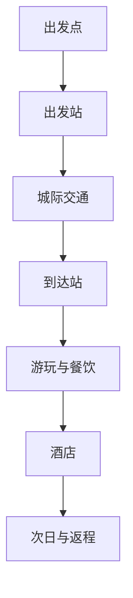
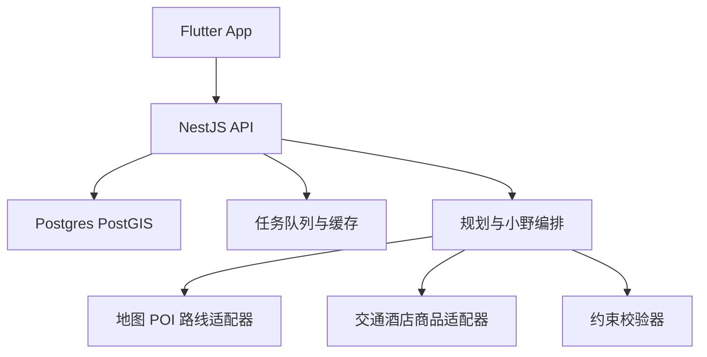

# 向野 App 全项目开发说明书

版本 2.1｜2026 年 9 月 25 日｜供产品负责人指挥开发 Agent 使用

> 本书对应完整移动 App，而非单一 AI 行程功能。默认首发中国大陆境内自由行，界面为简体中文，金额为人民币，时间按目的地时区展示。文内图示车次、酒店、金额与商家名称只用于界面演示，生产环境必须接入合法授权的数据源并重新核验。

## 0 如何使用这份说明书

本书由 **产品范围 → 页面与交互 → 视觉设计图 → 技术与接口 → Agent 任务包 → 验收** 组成。开发时先落地第 3 节的实体和状态约定，再按第 5 节页面编号分工。每张设计图的编号与页面编号一致；图只表达布局与层级，文字规格和状态规则以本书为准。配套的[《向野 App 界面设计图》](向野App界面设计图.html)有 12 张基础页面；[《多日行程地图交互稿》](向野多日行程地图交互稿.html)可切换 3 天、点选地图节点并演示替换；[《机酒预订界面稿》](向野机酒预订界面稿.html)有 7 张机票、火车票、酒店和订单界面。Logo 有 3 个可编辑 SVG 源稿。

**负责人需要决定的未定项：** “AI 入境”暂解释为“到达地点后用相机叠加地点介绍和留言”，功能名暂定“向野实景”；是否直接承接订单，默认先由合作方完成交易；Logo 默认采用 A 方案。以上不会阻塞第一阶段开发，均以 feature flag 控制。

**交付定义：** 一个用户能从输入出发地、目的地、日期和预算，得到真实来源可追溯的逐时行程图；用自然语言或点击节点修改；让小野解释、预览并确认改动；出行当天按图执行。商品、实景与社区分阶段接入，但在信息架构和数据模型中预留完整位置。

## 1 产品边界与版本路线

### 1.1 产品定位和原则

向野是“能执行、能修改、能陪伴”的旅行 App。用户不需要先学会制作攻略，只需输入基本约束；系统生成包含城际交通、站点到景点的市内交通、游玩、餐饮、酒店与返程的行程图。图上的每个点是可打开、可替换、有来源的对象；点之间的线是有出发时间、方式、耗时和费用的交通段。

四条产品原则：①不编造具体班次、库存和价格；②所有 AI 改动先预览再确认；③已订、锁定或已完成的节点得到保护；④相机、位置、公开分享都由用户主动触发。地图路线/地点数据与交通票务/酒店报价属于不同供应来源；地图 API 本身不代表具有可售票或酒店实时库存。[R1][R2]

### 1.2 版本矩阵

| 能力 | R0 可开发演示 | R1 首发 MVP | R2 商业与社区 | R3 增强 |
| --- | --- | --- | --- | --- |
| 输入与生成 | 模拟数据 + 契约 | 授权地图、真实供应商接入可用部分 | 多城与复杂约束 | 多人协作 |
| 多日地图与双模式编辑 | 三日地图交互原型 | 分天路线、地图点/列表同步、服务端版本与校验 | 多城概览、离线快照与延误重排 | 协作编辑 |
| 小野 | 解释与改图草稿 | 真实工具调用、在途问答 | 授权提醒与足迹总结 | 个性化偏好 |
| 机票火车票酒店预订 | 完整 mock 搜索/详情/确认/订单 | 有授权供应商时展示与跳转，回流订单状态 | 有创建订单与支付能力的合作方可启用 App 内完整预订 | 自营交易须另立资质与履约项目 |
| 景点餐饮影院团购 | 仅演示入口 | 授权商品的查询与跳转 | 多供应商比价、优惠与订单回流 | 更广品类 |
| 到点实景 | 地点页静态原型 | 主动定位 + 地点确认 | 相机覆盖层、留言与审核 | 空间锚点试点 |
| 社区与足迹 | 信息架构 | 个人私密足迹 | 动态、评论、收藏、举报 | 话题、共创线路 |
| 行前与在途工具 | 收藏与预算预览 | 行李/证件提醒、票据入口、逐日费用 | 天气备选、共享行程、开支记录 | 分账与同行投票 |

不纳入首发：自动帮用户支付或退票、未经授权抓取 OTA 价格、后台持续拍摄/定位、未实测覆盖的厘米级室外 AR、自动发布旅行日记。

### 1.3 用户任务和北极星

主任务 A：规划一趟预算内的旅行；任务 B：临时换点或延后出发；任务 C：旅途中确认下一步；任务 D：到点看攻略、留下回忆；任务 E：找到与行程兼容的商品。北极星候选为“保存后在旅行当天被实际打开的有效行程数”，同时监控首图生成率、来源完整率、局部修改成功率、预算超标率、失效报价点击率与 UGC 有效举报率。指标仅是初始建议，内测后定目标。

**地图是主界面，不是辅助缩略图。** 用户可以先看跨多天行程覆盖范围，再进入某天的详细路线；从地图点开任何行程节点直接查看、替换、锁定或导航。时间轴与地图共用一张有向图，所有编辑都同步反映在两个视图。

## 2 信息架构和关键用户流程

### 2.1 五个一级入口

| 底部导航 | 功能子页 | 首页默认模块 |
| --- | --- | --- |
| 发现 | 推荐目的地、玩法合集、地点详情、社区动态 | 出发灵感卡、周末玩法、热门地点 |
| 计划 | 创建行程、多日地图、每日路线、版本、预算、分享 | 最近行程、跨天地图与时间轴 |
| 出发 | 今天的行程、下一站、导航、提醒 | 当前进行中的旅行与下一段交通 |
| 足迹 | 我的旅行地图、相册、日记、私密/公开内容 | 已完成旅行时间线 |
| 我的 | 账号、偏好、订单跳转记录、通知、隐私 | 身份和设置 |

“小野”是全局浮动入口，不占底栏；行程上下文存在时默认读取当前版本，无行程时作为规划问答助手。商品不占独立底栏，挂在地点页、节点详情和发现页。社区主入口在发现页的“动态”标签、地点页的留言区和足迹发布页。

### 2.2 主链路 A 创建行程

`发现/计划 → 新建计划 → 输入出发地、目的地、时间、预算 → 补充人数与偏好 → 生成进度 → 行程图 → 查看来源和费用 → 保存 → 出发模式`。城市名重名时弹出选择器；预算分“每人/整单”，默认整单且含往返；用户手工输入位置不需要定位许可。生成过程是异步任务，退出页面后可返回查看，不重复扣费或生成重复版本。

对于 3 天及以上行程，生成完成后先落到“全部日期地图总览”，展示各日区域和过夜点；从日期条选某一天进入地图+时间轴分屏。用户也可从日历视图检视每天开始、结束、酒店和预算。周边候选只影响选中的日子，跨日更改有明确提示。

### 2.3 主链路 B 修改节点

`行程图点节点 → 节点详情 → 替换 → 候选列表 → 差异预览 → 用户确认 → 新版本`。只重算目标点与受影响交通边；如果修改跨越当天或导致酒店、返程冲突，差异预览明确列出全部受影响点。候选不足时说明原因并允许用户手动搜索 POI。

### 2.4 主链路 C 自然语言修改

`小野输入“第二天上午换成室内，酒店别动” → 解析目标与保护条件 → 改图草稿 → 差异预览 → 保存或继续修改`。目标不明确时小野列出可能节点让用户点选；已订节点变更需要单独确认并跳转原供应商办理，不执行订单取消。

### 2.5 主链路 D 在途和到点

`出发页 → 当前节点 → 导航/票据入口 → 到达确认 → 地点页/实景 → 小野现场问答 → 私密留言或公开发布 → 足迹`。首次打开相机或位置功能时按需授权；无权限时可手选地点并查看地点内容。

## 3 全局状态、数据来源与设计系统

### 3.1 状态枚举

行程 `draft/generating/ready/in_progress/completed/archived/failed`；节点 `planned/locked/booked/completed/skipped/conflict`；报价 `verified/estimated/unknown/expired/unavailable`；帖子 `draft/pending/published/rejected/removed`。前端颜色只辅助识别，必须同步显示文字状态。所有金额为整数分，显示格式由客户端统一处理；时间持久化 UTC，展示使用地点时区。

### 3.2 数据真实性和销售边界

| 状态 | 来源条件 | 用户看到的表达 | 操作限制 |
| --- | --- | --- | --- |
| 已核验 | 合作供应商返回班次/房价/库存及查询时间 | “¥xxx 起 · 10:32 查询”与来源 | 购买前再次校验 |
| 参考 | 地图 POI、导航路线、公开营业时间 | “参考路线/营业时间，以现场为准” | 可加入计划，不宣称售卖 |
| 估算 | 规则估计打车、餐饮、住宿区间 | “估算 ¥a–b”附计算假设 | 无购买按钮 |
| 待查询 | 未接入、超时或无结果 | “班次待查询/价格待查询” | 禁止模型补出数字 |
| 已失效 | 报价过期/无货 | “已失效，重新查询” | 禁止旧价下单 |

**重要：** 用于演示的“上海虹桥—杭州东 09:10”等时刻只能在设计图显示“示意”，不能进入生产数据。模型被限制为解释结构化候选，不可自行生成真实世界的票务事实。规划服务必须记录 `provider`、`fetched_at`、`expires_at`、`provider_ref` 与 `license_scope`。[R1][R2]

### 3.3 视觉规范

品牌主色森林绿 `#2F604A`，强调草芽绿 `#BCE39A`，暖纸白 `#F7F5EB`，文字墨绿 `#18291F`，错误红 `#B23A3A`，提示黄 `#E9B95B`。页面白底或暖白底，卡片圆角 16，按钮圆角 14，手机横向留白 20，8 像素栅格；正文 14–16，辅助 12–13，标题 24–30。一级按钮绿色白字，次级按钮白底绿边；底栏五等分。最小可点面积建议 44×44 px，支持系统动态字号与屏幕阅读器。

**Logo：** A 山野箭头用于 App 图标；B 路线双点用于加载和图谱；C “向野”字标用于启动页和分享页。三方案均为概念 SVG；后续需商标、字体和视觉原创性确认。小野的角色视觉采用 A 图标中的小圆点/箭头组合：聊天头像为圆润小山形，状态“倾听/思考/完成”分别使用轻微呼吸、路径生长、星点闪现动画；减少对低端机的动效负担。

  

### 3.4 共用组件清单

`XYAppBar`、`XYTabBar`、`XYButton`、`XYChip`、`XYMoney`、`XYSourceBadge`、`XYTripNode`、`XYTripEdge`、`XYOfferCard`、`XYPoiCard`、`XYChatBubble`、`XYDiffRow`、`XYBottomSheet`、`XYEmptyState`、`XYPermissionPrompt`、`XYToast`、`XYSkeleton`。每个组件需定义默认/按下/禁用/加载/错误状态、语义标签与浅色背景对比度。图谱节点不依赖单一颜色表达价格来源。

地图与交易组件：`XYDayStrip`、`XYMapMarker`、`XYMapLegend`、`XYMapTimelineSheet`、`XYTransitSegment`、`XYTripCalendarCard`、`XYBudgetBreakdown`、`XYFareCard`、`XYHotelRateCard`、`XYPolicyDisclosure`、`XYBookingStatus`、`XYOrderPriceBreakdown`。地图点需测试触控与聚合；商品卡在列表与地图底抽屉使用同一价格来源标识。

### 3.5 成熟产品的结构参考

| 公开产品能力 | 可借鉴的交互原则 | 向野如何处理 |
| --- | --- | --- |
| 携程公开介绍覆盖机票、火车票、酒店、景点与订单服务 [R8] | 预订从搜索、筛选、详情、确认、订单到售后形成闭环 | 入口挂在行程对应节点，购买后核对整张多日图 |
| Wanderlog 公开展示行程与地图同屏 [R9] | 同时理解“点在哪里”和“什么时候去” | 多日总览、单日地图与时间轴共用一个图版本，地图点可替换 |
| 携程商旅公开描述行程变化会影响关联订单 [R10] | 修改计划时提示订单影响 | 预览列出受影响机票/酒店，改图不自动退订 |

只借鉴信息架构和交互原则，不照搬产品的图标、品牌色、页面布局和文案。向野的辨识点是可编辑的多日地图与小野生成的可确认差异。

## 4 App 全页面清单与路由

| ID | 路由 | 页面 | 优先级 | 对应设计图 |
| --- | --- | --- | --- | --- |
| S01 | `/onboarding` | 欢迎与隐私引导 | R1 | 品牌页 |
| S02 | `/discover` | 发现首页 | R1 | 图 01 |
| S03 | `/plan/new` | 新建计划输入 | R1 | 图 02 |
| S04 | `/plan/generating` | 生成进度与错误恢复 | R1 | 图 03 |
| S05 | `/plan/:id` | 行程图时间轴与地图 | R1 | 图 04 |
| S06 | `/plan/:id/node/:nodeId` | 节点详情与候选替换 | R1 | 图 05 |
| S07 | `/plan/:id/diff/:draftId` | 修改差异预览 | R1 | 图 06 |
| S08 | `/assistant` | 小野 AI 旅途助手 | R1 | 图 07 |
| S09 | `/journey/:id/today` | 出发当天模式 | R1 | 图 08 |
| S10 | `/place/:id` | 地点详情与留言 | R2 | 图 09 |
| S11 | `/place/:id/camera` | 实景相机与地点内容 | R2 | 图 10 |
| S12 | `/offers` | 酒店景点影院团购 | R2 | 图 11 |
| S13 | `/community` | 社区动态与发布 | R2 | 图 12 |
| S14 | `/footprints` | 足迹与旅行日记 | R2 | 设计图共用图 12 卡片样式 |
| S15 | `/profile` | 我的、偏好、隐私与通知 | R1 | 组件规范 |
| S16 | `/admin` | 运营审核后台 Web | R2 | 功能规格，不属于手机界面 |
| S17 | `/plan/:id/map` | 跨多天地图总览 | R1 | 地图交互稿图 13 |
| S18 | `/plan/:id/day/:dayId` | 单日地图与时间轴 | R1 | 地图交互稿图 14 |
| S19 | `/plan/:id/calendar` | 多日概览日历 | R1 | 地图交互稿图 15 |
| S20 | `/plan/:id/expenses` | 预算、票据与行前清单 | R1/R2 | 地图交互稿图 16 |
| S21 | `/booking/transport` | 机票与火车票搜索比较 | R1/R2 | 预订稿图 17 |
| S22 | `/booking/flight/:offerId` | 航班与票价详情 | R2 | 预订稿图 18B；火车票变体图 18 |
| S23 | `/booking/hotels` | 酒店列表与地图筛选 | R2 | 预订稿图 19 |
| S24 | `/booking/hotel/:id` | 酒店详情与房型 | R2 | 预订稿图 20 |
| S25 | `/booking/checkout` | 乘客/住客信息与订单确认 | R2 | 预订稿图 21 |
| S26 | `/orders` | 订单状态、售后与行程关联 | R2 | 预订稿图 22 |
| S27 | `/orders/:id/service` | 退改与供应商客服 | R2 | 图 22 内次级状态 |

### 4.1 功能模块覆盖矩阵

| 模块 | 用户看得见的功能 | 默认优先级 | 核心页面 |
| --- | --- | --- | --- |
| 发现与收藏 | 目的地搜索、周末玩法、地点收藏、雨天/室内筛选、社区灵感 | R1 基础，R2 内容 | S02 S10 S13 |
| 多日规划 | 逐时生成、跨城交通、每日酒店、餐饮与自由时间、多个候选方案 | R1 | S03 S04 S05 S17 S19 |
| 可编辑地图 | 全部日期/每日图层、路线点与编号、地图/列表联动、点选替换、加点与重排预览 | R1 必须 | S05 S06 S07 S17 S18 |
| 小野助手 | 行程问答、解释来源、自然语言改图、延误/雨天备选、旅途总结草稿 | R1 核心，R2 增强 | S08 S09 S11 |
| 机票与火车票 | 往返/单程查询、筛选比价、班次/票价详情、乘客、验价、订单与退改 | R1 mock，R2 真实接入 | S21 S22 S25 S26 S27 |
| 酒店与团购 | 地图看酒店、房型与取消规则、景点/餐饮/影院商品、下单与售后入口 | R1 mock，R2 真实接入 | S12 S23 S24 S25 S26 |
| 出发工具 | 下一站导航、提醒、离线行程快照、证件清单、电子票据、异常重排 | R1 基础，R2 扩展 | S09 S20 S26 |
| 预算与同行 | 每日分类预算、真实支出记录、只读分享、同行受邀查看；分账与投票后续 | R1 预算，R2 同行，R3 分账 | S19 S20 |
| 地点实景 | 主动相机、地点确认、地点留言、附近推荐、拍照收藏 | R2 | S10 S11 |
| 足迹与社区 | 到访确认、相册、游记、动态、评论、收藏、举报与审核 | R2 | S13 S14 S16 |

**方案对比：** 生成时可给“省钱/少折腾/深度玩”三个可行候选，三套方案独立版本并列对比总费用、交通耗时、步行量和必去点覆盖；选择一套后才成为正式图。R1 至少提供主方案与一个备选，候选数不足时说明原因。**同行权限：** R1 分享只读链接可撤销；R2 邀请同行建议修改但只由行程所有者确认；R3 再做多人投票和费用分摊，避免首发并发编辑失控。

## 5 逐页功能与交互设计

### S01 欢迎与账号

**布局：** 上部品牌标志与“想去哪，先向野看看”，中部两张示例行程卡，下部“开始规划”“登录并同步”及隐私条款。首次规划允许游客创建本机草稿；保存至云端、跨设备同步、发布、评论或下单前要求账号。不要把位置或相机许可放在首屏。

**逻辑：** 用户点“开始规划”进入 S03；点“登录”使用手机号验证码或团队选定的合规方案。验证码倒计时、频控和错误信息清晰。游客转账号后询问是否导入本地草稿，冲突按最近更新时间提示选择。退出登录后清理敏感缓存，保留经用户确认的公开数据。

**状态/API/验收：** 无网允许游客查看本地草稿；登录失败保留表单；`POST /auth/send-code` 与 `POST /auth/verify` 服务端限流。拒绝服务条款不能提交注册。权限授权只在对应功能触发时出现。

### S02 发现首页 图 01

**布局：** 顶部“向野”字标与当前位置可编辑入口；大面积绿色欢迎卡“这周末，去哪？”加小野输入框；横向玩法筛选“近郊/自然/城市/雨天”；下方目的地卡与“跟着行程走”社区精选，底部导航固定。

**操作：** 点搜索进入地点搜索；点灵感卡进入 S03 且预填目的地/主题；点社区卡进入 S13；点小野输入框进入 S08 并保留输入。推荐理由需显示出发地与偏好依据，可关闭个性化推荐。无定位时用用户选择的城市；无推荐时展示编辑精选而非空白。

**数据/API/验收：** `GET /discover?city_id&filters` 返回卡片、来源与推广标识；营销卡与自然推荐明显区分。滚动位置返回时保留，图片加载失败显示色块和地点名。

### S03 新建计划 图 02

**布局：** 顶部进度“1/2 基本信息”；出发城市/具体地点、目的地、日期范围、人数、总预算四个核心输入突出；折叠区域是交通偏好、节奏、必去点、酒店上限、步行限制；底部固定生成按钮和预算说明。

**操作：** 城市搜索需消歧，日期不能早于当天，结束不早于开始；预算可以切“整单/每人”，默认整单且含往返。选择具体站点不是必填，系统不得把城市中心点当个人起点。提交前展示摘要；相同幂等键不重复创建。入口可从发现卡预填但需用户确认。

**状态/API/验收：** `POST /v1/trips/generate`；字段验证在客户端和服务端双重执行。预算过低允许提交探索，但先展示预算可能不足提示；没有目的地、时间或预算不能提交。键盘弹出时固定按钮不遮挡字段。

### S04 生成进度 图 03

**布局：** 路线点动画，四个步骤“查找地点/安排交通/匹配住宿/检查预算”，显示当前可确认的数据量，不伪造百分比。支持退出后回到计划列表。

**操作：** `GET /v1/jobs/:id` 轮询或推送；超时转后台任务并可通知用户。无授权班次接口时显示“城际交通待查询”，任务仍可产出带未知节点的计划；关键约束无法满足时显示冲突和修改输入按钮。取消只取消当前生成任务，不删除用户输入。

**验收：** 模型返回非法 JSON、地图超时、供应商无票、App 退到后台后恢复都有稳定结果，不出现无限转圈或重复付费调用。

### S05 行程图 图 04

**布局：** 标题“杭州 3 天 2 晚”，顶部日期标签与预算摘要；默认**地图+时间轴分屏**，地图约占 55% 可拖动区域，底部节点列表约占 45% 且可上拉全屏。顶部“全部/第 1 天/第 2 天/第 3 天”横向日期条；“地图/列表/日历”三态切换。地图显示按天着色且带序号的节点与路径，时间轴显示时刻、地点和价格状态；交通边显示方式、耗时和费用。右上有图层、适配全程范围、定位入口；底部“小野帮我调整”。完整交互见 S17/S18 与地图交互稿。

**规则：** 节点类型为起点、城际交通、换乘、游玩、餐饮、酒店、自由时间、终点；边是显式交通段。点节点打开 S06，长按可锁定或标完成，移动节点需进入编辑而非直接拖坏时间约束。地图标记与时间轴共用 `node_id`，任意一侧选择都滚动/聚焦另一侧。图上已订有锁标，冲突有醒目文字。多日地图的颜色按天区分，形状按类型区分，不能只靠颜色；酒店节点跨日相连。

**状态/API/验收：** `GET /v1/trips/:id?version=n`；切天只过滤本地现有图，不重新生成，离线可读最近快照但报价标过期。每个游玩或酒店节点能追踪地点/供应商来源；每条边能看到 A→B 的方式、耗时、估算/报价与查询时间。超过预算必须给出缺口。跨城长段路线有“交通段”样式与起终点，不把两城画成伪造的地面直线路径。

### S06 节点详情与替换 图 05

**布局：** 从底部弹出占屏约 80% 的面板，上方节点名、时段、地点、费用与来源，中段 A→B 交通及开放时间，下方固定“替换这个点”“改时间”“锁定”“导航”。点替换进入候选列表，候选卡突出时间窗、预算差、到达便利和营业状态。

**操作：** 先选替换类型（同类/室内/附近/手动搜索）；服务端查 POI 和相邻边；默认展示最多 3–5 个可行候选。选择候选仅生成草稿，跳 S07；锁定不触发整图重排。已订商品节点先显示处理提示，不直接删除真实订单。

**状态/API/验收：** `GET /v1/trips/:id/nodes/:nodeId/candidates`，`POST /edit/preview`。候选为空时给修改时间/预算/半径入口；供应商失败时展示来源失败范围。节点 ID 在替换后按修订规则保持引用连续，历史版本可找回原节点。

### S07 差异预览 图 06

**布局：** 标题“确认这次调整”，上方左右/上下呈现旧方案与新方案，红/绿标签标节点删增、时刻变化、交通变化；总费用区间和预算余量固定可见；下方“保存为新版本”与“继续修改”。

**操作：** `draft_revision` 不写入正式行程；用户确认后用 `If-Match` 提交，保存返回新版本，支持撤销。跨日或已订节点影响需单独列出并要求二次确认。用户退出该页可找回草稿，但超过有效期需重新刷新报价。

**验收：** 取消不改原图；两设备同时编辑旧版本返回 `VERSION_CONFLICT` 并提供合并可行内容；点击保存多次只有一个版本。聊天文案与实际 patch 一致。

### S08 AI 旅途助手小野 图 07

**布局：** 顶部显示当前绑定行程及“正在使用的资料”，中部聊天记录，底部输入框和快捷指令“安排雨天备选”“预算再省 200”“下一站怎么走”。小野回复卡分为“我的建议、依据、会改动的地方”；修改结果以 S07 差异卡嵌入对话，不仅是一段文字。

**能力：** 规划前补充缺项，规划后解释路线与费用，在途提醒下一站及应变，地点现场答疑，商品条款对比，旅行结束生成私密游记草稿。每个回答引用当前版本、数据时间和供应商；不确定时明确“我还不知道”。只有只读查询和创建改图草稿的工具权，不能直接付费、取消订单、发布公开帖或绕过锁定节点。

**典型交互：** 用户说“高铁晚点 90 分钟，今晚酒店别动，下午只逛西湖”。小野先问延误来自实时数据还是用户告知；基于新的抵达时刻重排同日节点，锁定酒店，算出交通与费用差，展示差异卡。用户点确认才保存；若无可行方案则说明冲突并给替代。

**状态/API/验收：** `POST /v1/assistant/messages` 接流式回复，工具执行日志服务端记录。拒绝注入、错误资料、不足权限、超时与无网络时给可操作的恢复提示。用户能关闭位置上下文、删除对话和稳定偏好。小野可解释“第二天”“今晚”“这个点”的指代，歧义时选择目标。

### S09 出发当天 图 08

**布局：** 顶部当前天气与“今日 3/7 节点”，大卡显示下一站、最晚离开时间、路线/费用、导航按钮；下方为今天时间轴、票据与酒店入住提醒。天气只能来自接入的服务，没有则不显示假数据。

**操作：** 到达由用户手动确认或主动定位提示后确认；延误提醒进入小野的局部调整；导航使用地图提供商的合法唤起能力。已完成节点不可被 AI 自动改写。离线时可读计划和导航文字但不保证地图实时路线。

**状态/API/验收：** 未开始旅行显示“选择一趟行程”；提醒需要单独通知权限，可选择静默时段。无真实延误源时不说“已晚点”，只提示用户核对。若预计赶不上下一站，给当前已核验/估算依据。

### S10 地点详情 图 09

**布局：** 地点封面、名称/地址、开放时间及数据时间、特色摘要；入口“加入行程”“问小野”“打开实景”；下方标签“攻略/留言/商品”。用户留言显示可见范围与审核标识，团购卡有供应商和条款摘要。

**操作：** 加入行程需选日期时间并生成编辑草稿，不能直接塞进冲突位置。点赞、收藏、评论、举报都有反馈；地点重名时地址与地图坐标必须可核对。地点关闭/停业显示警示。

**状态/API/验收：** `GET /v1/places/:id`、`GET /posts`、`GET /offers`。媒体加载失败保留文案和操作，审核中的留言只作者可见，审核拒绝可申诉。

### S11 向野实景相机 图 10

**布局：** 全屏相机预览，顶部“附近地点：西湖断桥”与切换地点，下方最多 2–3 张地点级浮层卡，底部“拍照留言”“问小野”“返回”。卡片固定在安全视觉区域，不挡道路/台阶；实景模式有明显退出按钮。

**实现层级：** R2 使用用户主动打开相机 + 粗定位 + POI 候选 + 用户确认的地点级屏幕覆盖层；OCR/图像识别只用于地点候选，不把结果当确证。R3 才试点 ARKit/ARCore 地理锚点，启动时检查设备与当地可用性，失败退回地点卡。ARKit 地理追踪依赖位置可用性检查，ARCore 地理能力依赖设备和地图覆盖。[R3][R4]

**隐私与验收：** 相机帧默认只在本机处理，用户按发布才上传所选照片；剔除 EXIF；精度差要求手选地点；拒绝相机许可仍能在 S10 读留言。默认仅自己可见，公开发布有明确选择，不展示精确到分钟的真实到访时间。

### S12 酒店景点影院团购 图 11

**布局：** 顶部筛选“酒店/景点/餐饮/影院”，商品卡显示名称、距离行程节点、适用日期、权益、含税/附加费、价格与供应商；底部保留预算余量。当前计划内酒店页优先显示能在当天交通可达的房源。

**操作：** 筛选日期、人数、退款政策与预算；点商品看完整条款，点购买前重新验价；R2 默认跳合作方完成支付。无订单回流时只显示“已跳转”，不能显示“已预订”。团购需有授权商家和合法商品接口，不抓取页面。推广标识与推荐理由分别展示。

**状态/API/验收：** `GET /v1/offers`、`POST /v1/quotes/revalidate`、`POST /v1/offer-clicks`。价格变更展示新旧差，过期/售罄禁用购买，退款规则不清楚则不得引导下单。酒店每晚与房间数的总价需可核对。

### S13 社区动态 图 12

**布局：** “关注/发现/附近”标签；动态卡含作者、关联地点、内容、图片、体验日期、收藏/评论/复制路线；底部发布入口。附近标签第一次打开时按需申请定位，也允许选城市。

**发布：** 内容支持图文、地点、旅行路线摘要；可见性“仅自己/同行/公开”，默认仅自己；发布前脱敏酒店房号、订单号与实时轨迹。公开路线被复制时成为新用户草稿，POI 营业与价格重新查询。用户可删除、屏蔽、举报，审核后台可下架与处理申诉。

**状态/API/验收：** `GET /v1/feed`、`POST /v1/posts`、`POST /v1/posts/:id/reports`。审核中不可出现在公共流；删除后列表与地点页同步消失。AI 生成或修改的内容按适用规定标识。[R5][R6]

### S14 足迹 S15 我的 S16 运营后台

**足迹：** 私密旅行列表、已到达节点地图、照片选择、按日期生成游记草稿、一键编辑/发布；不自动把计划当成真实到访，只有用户确认或授权证据的节点可写入“已去过”。无照片时用文字时间线。单趟旅行可导出非敏感分享卡。

**我的：** 账号与设备、旅行偏好、通知、已跳转订单入口、供应商售后入口、数据导出/删除、隐私许可、黑名单与客服。商品订单状态仅供应商回流时显示。游客可查看本地草稿和清除数据。

**运营后台：** 登录角色 `moderator/operator/admin`，包含 UGC 审核队列、举报与申诉、地点纠错、商品屏蔽、供应商故障与数据新鲜度、用户封禁、审计日志；所有下架动作写操作人、原因和时间。后台是独立 Web 控制台，权限与 App 用户 API 隔离。

### S17 跨多天地图总览 图 13

**布局：** 标题与预算摘要下方是横向日期条“全部/周五/周六/周日”；全屏地图显示每天不同颜色的节点序号、日间线路与酒店月亮标记，左下图例解释天数和交通方式，底部抽屉列出每天“起点—重点地点—住宿—费用区间”。长途飞机/高铁作为单独的跨城边，缩放到整趟范围时只显示起终城市与交通标签，不伪造路面线路。

**交互：** 选“全部”适配所有节点视野，点一天只显示该日路径并聚焦范围；点标记打开节点卡并高亮时间轴对应项；点酒店显示连续入住晚数；地图拖动/缩放不改变当前日期筛选。两个地点过近时聚合为“3 个点”，点击展开。定位按钮只在用户授权后显示当前位置；无授权仍能看行程。点“列表”进入 S19，点“详细路线”进入 S18。

**状态/API/验收：** 前端利用已加载 `TripGraph` 绘图，地理底图与路线几何来自有授权地图 SDK。城市间没有路线 geometry 时用交通图标与文字衔接。离线只显示许可范围内可缓存内容和上次快照，明确“地图不可用”时退回列表。缩放、切天、选点无需调用生成 AI。

### S18 单日地图与时间轴 图 14

**布局：** 地图上 1、2、3… 对应时间轴中的节点编号；线段按步行、公交/地铁、驾车等方式用线型区分，城际边用交通卡而非不实画线。屏幕下部是可上拉的时间轴，显示到点、离点、交通耗时、总步行量、当日已花/待花预算。酒店与次日第一个节点有“过夜连接”。

**交互：** 点地图节点、点时间轴节点、地图滑动选点相互同步。点弹出的底卡有“详情/替换/锁定/导航/加到收藏”；点替换进入 S06，返回后保留地图视角和选中节点。点边展开 A→B 具体换乘、费用和来源；按交通方式过滤时仅隐藏地图层，不改变计划。可用“加入一个点”在两个节点间插入候选，先预览冲突再保存。

**验收：** 替换后节点、前后两条边、当日费用、跨天住宿冲突同步更新；图和时间轴不会显示不同版本。多日图最多渲染当前视野需要的标记，点密集地区可用聚合。无几何信息时用列表直达导航，不画虚构道路。

### S19 多日概览日历 图 15

**布局：** 每日卡显示城市/区域、3 个主要节点、酒店、活动时长、交通时长、步行量、预算区间和天气（有数据时）；月历只用于日期切换，详细计划用纵向日卡。跨城市转移日显示“交通日”分隔卡。可快速看哪天太满、哪天留空。

**交互：** 点日卡进入 S18；点“松一点”让小野只调整当天；长按顺序手柄可请求重排，但已订节点保持锁定，须生成差异预览。酒店入住跨两天，在两个日卡各有入住/退房提示，不重复计算房费。

### S20 预算票据与行前清单 图 16

**布局：** 顶部预算分配图（交通、住宿、餐饮、门票、预留），下方逐日花费表、已订/待订分组、电子票据入口和行前清单。每一笔显示已支付、已核验未支付、估算或待查询，不把预算估算当订单支付。

**交互：** 用户可手动记账（现金/转账/其他，不保存完整金融账户）、按人数分摊查看；订单从有授权的供应商回流时自动关联到对应节点与日期，用户可手动关联外部票据附件。行前清单可勾选证件、衣物、酒店入住信息和出发提醒。R2 多人共享预算只分享总额与用户明确授权的记录，默认不共享个人支出明细。

### S21 机票火车票搜索比较 图 17

**入口：** 行程图的“城际交通待查询”、首页“机票/火车票”、小野推荐卡。沿用已输入城市、日期、人数，用户可改站机场和出发时间窗。上方“机票/火车票/全部”标签，结果按总耗时与总价比较，并计入到机场/车站及抵达后到酒店的接驳时间和费用。返程与去程分开选择，先选去程再选返程。

**列表：** 每条结果显示出发/到达当地时刻、站机场、航班号或车次（仅供应商数据）、总耗时、直达/中转、舱位或席别、行李/退改摘要、价格适用人数与查询时间。筛选出发时段、总耗时、中转、航空公司/车种、行李、退改、总价；排序综合推荐/时间/价格。无库存或无授权结果时明确“待查询”，保留外部合作方查询入口，不显示编造的具体班次。

### S22 航班详情 图 18

**详情：** 去返程航段、机场与航站楼、转机时长、经停、承运方、舱位、行李额、改退规则、保险等附加项单列且默认不勾选。价格拆分票价、税费、服务费、附加产品、人数合计；非实时值醒目标明。选票价方案后进入 S25，离开页面超过报价有效期需刷新。

**火车票变体：** 与 S22 共享详情容器，改为车站、车次、席别、余票状态、取票/乘车证件要求、退改规则；无席别时不能选中。车次和航空信息不由 LLM 生成。若供应商只支持跳转，详情页显示“前往合作方预订”，不收集乘客证件和支付信息。

### S23 酒店列表与地图筛选 图 19

**入口：** 行程图过夜节点、首页酒店快捷入口、地点页推荐。日期默认按该过夜段入住/退房，人数房间数与行程同步；列表和地图一键切换。地图显示酒店价格标记和当前行程节点，筛选距离地铁/景点、每晚含税价、免费取消、早餐、房型、评分、无障碍和可入住时间；地图价标点击对应列表卡。

**规则：** 价格按完整房晚与人数拆解，标出税费/押金和付款方式。夜晚地点变更时重新计算前后交通与入住时间；酒店候选不应只按最低价推荐，需考虑总路程、入住窗口和预算。没有供应商许可的数据不得展示具体房型库存。

### S24 酒店详情与房型 图 20

**详情：** 图片/地图位置、距行程关键点、入住退房时间、设施、政策、近期评价来源；下方房型与套餐卡逐一展示床型、人数、早餐、取消时间、是否预付、完整总价和供应商。用户点房型“加入当前行程”先生成差异草稿；点“预订”进入 S25 或授权合作方页面。政策展开可读，不用隐藏在一行小字里。

### S25 订单确认与支付边界 图 21

**原生交易路径仅在合作接口允许时启用：** 乘机人/乘车人或住客信息按商品最小要求收集，支持复用但不预填他人的证件；联系人、通知方式、条款、总价明细、改退政策逐项确认。点击付款前必须二次验价和库存；价格变化重新展示差额及原因。支付使用合规合作方/支付组件，向野服务端不保存完整银行卡信息。下单与支付调用带幂等键，超时先查单，不能盲目重试造成重复订单。

**合作方跳转路径：** 不显示本地“付款成功”。跳转前展示供应商名称、商品摘要与需要在合作方完成预订的提示；返回后有订单回流才确认预订成功，没有回流显示“已跳转，去合作方查看”。若要把成功订单加入行程，用实际确认信息替换原估算节点并再次校验图。

### S26 订单中心与 S27 退改 图 22

**状态：** 待支付/支付处理中/已确认/出票中/出票成功/已取消/退款中/退款完成/失败/状态未知，状态只来自有授权订单接口。订单卡有供应商、实际乘客或房间数的脱敏摘要、日期、最终金额、关联行程节点、电子凭证与客服入口。异常支付先查订单状态；状态未知提示等待和联系供应商。

**售后：** 根据合同和接口能力决定 App 内申请或跳原供应商。用户发起退改前显示适用规则、可能费用、受影响的行程节点与替代交通/住宿。订单退改成功后行程图节点更新为冲突或待替换，由小野提出重排草稿，不能自动改订其他商品。供应商无能力时仅提供订单查询与售后入口。

## 6 行程引擎详细设计

### 6.1 输入和结果

必填 `origin_city_id,destination_city_id,start_date,end_date,party_size,budget_fen,budget_scope`；可选 `origin_place_id,transport_preference,hotel_room_count,pacing,walking_limit_m,must_visit_place_ids,avoid_place_ids,accessibility,meal_preferences`。预算范围注明往返、每人/整单；住宿房间数默认根据人数建议但由用户确认。结果为 `TripGraph`，含节点 `TripNode[]`、有向边 `TripEdge[]`、预算明细、数据证据、警告和版本。

### 6.2 规划步骤

1. 规范城市/地点/日期/时区，处理同名 POI，进行基本约束检查。
2. 查询授权地图 POI、路网、市内交通、营业信息；若有授权供应商，查询城际班次、酒店与活动报价。
3. 固定出发、抵达、过夜、返程等硬节点；为换乘和交通安检加入可配置缓冲。
4. 在营业时间、位置、行程节奏、预算、交通可达性下生成候选图并评分。
5. 校验节点时序、边的通行时间、酒店夜数、硬预算、已锁节点与数据真实性。
6. LLM 仅解释已生成的结构化图，按 schema 输出理由；不能发明班次或报价。校验失败重算或返回可解释的不可行原因。

**约束不变量：** `start_at < end_at`；边抵达+缓冲≤下一个节点开始；同一旅客节点不重叠；每过夜日有住宿或明确夜间交通；已订和已完成不可被自动更改；预算不足时先给可选放宽项；库存过期不能标已核验。建议预留 10% 预算用于意外花费，用户可调整。

### 6.3 局部编辑算法

自然语言先转为 `intent={scope,operation,constraints,protected_nodes}`，点节点编辑转为同一 `PlanPatch`。求影响域：目标节点、入边、出边、同日后继节点；跨天冲突才扩大域。固定保护节点并重新求解影响域；重算成本及时间；写 `DraftRevision`；前端展示差异；用户确认后以 `base_version` 乐观锁事务提交。撤销是新的逆向 revision，不删除审计历史。所有人工备注按节点稳定 ID 迁移。

### 6.4 图表示例



边对象示例：“杭州东站 → 西湖”，方式“地铁 + 步行”，出发/到达本地时间、需走 700 米、预计 34 分钟、费用 ¥4/人、来源“地图服务”、查询时间。价格与方式变动都能在 S07 预览中比较。

### 6.5 多日地图数据与渲染规则

`TripDay` 包含 `day_id, local_date, city_ids, node_ids, overnight_place_id, cost_summary, map_bounds`。每个节点存 `day_id, sequence, canonical_place_id, coordinate_system, latitude, longitude, marker_type`；每条边存 `from/to, mode, duration, cost_state, geometry_ref, geometry_status`。时间轴和地图只消费同一 `TripGraphVersion`，不得维护两份独立可编辑列表。图层组件根据 `day_id` 过滤，而不是为每一天重新请求生成。

**可视化规则：** 全部日期选中时，按天分别着色，低缩放聚合相邻节点；选中某天后编号重置为当天 1…N，并绘制该天经地图服务许可的实际路线 geometry。步行实线、公交/地铁虚线、驾车双线；城际铁路/航班显示符号化“交通段”与城市端点，不把不可得的线路坐标画成真实轨迹。地图上永久可见图例和数据更新时间。酒店月亮标记可连接入住和次日退房；跨天边标时间与日期变化。夜间/多城计划自动适配跨日和时区。

**交互契约：** `select_node(id)` 同时更新地图 halo、底卡和列表焦点；`select_day(day_id)` 更新图层和视野并保留此日上次地图缩放；`replace_node` 调用统一改图预览，成功后用新版本原子更新 map/list/budget；`fit_bounds` 要留足顶部日期条与底抽屉的安全边距。地图标记聚合后点聚合展开列表，不误触直接替换。无经纬度节点（自由时间/待定住宿）在列表显示“位置待定”，地图不造点。

**出行时：** 只在用户授权后显示蓝色自身位置，位置点与规划标记视觉不同；地图离线可用性依地图供应商许可和 SDK 能力，不自行抓取瓦片。线路失效时保留标记和上次查询时间，边改“请重新查询”。用户拖动地图仅改变视角，不偷偷更改行程顺序。

## 7 小野 AI 助手的执行契约

**上下文：** `trip_id`、当前版本、目的地时区、当前/下一节点、剩余预算、已订/锁定状态、用户主动授权的粗位置、已保存偏好。对话不能用陈旧版本执行写操作；临时对话上下文与长期偏好分开，长期偏好逐条可删除。

**工具白名单：** 只读 `get_trip,get_node,search_place,get_route,get_quote,get_public_posts`；可写草稿 `create_plan_patch,preview_revision,create_footprint_draft`。`commit_revision` 由用户确认后通过客户端提交；支付、退票、公开发帖不对 LLM 暴露。任何工具响应带 `source` 和 `fetched_at`。外部评论、商家文案、网页都视为不可信数据，不能改变工具权限。

**意图输出：** `ANSWER`（直接回答）、`CLARIFY`（消歧）、`PLAN_PREVIEW`（改图草稿）、`NO_DATA`（说明缺口）、`HANDOFF`（跳供应商/客服）。答复模板自然简短：结论、依据/更新时间、下一步按钮。流式输出发生工具失败时，不先说“已经改好”；只有收到新版本后才说已保存。AI 推荐的商品要注明推广关系；公开 AI 生成内容按适用规则标识。[R5]

## 8 数据模型、API 与外部集成

### 8.1 数据实体

| 表/聚合 | 关键字段 | 关系与索引 |
| --- | --- | --- |
| `users` | id, auth_state, preferences, consent_version | 用户偏好和授权分开 |
| `trips` | id, owner_id, status, timezone, budget_fen, party_size, current_version | owner + 更新时间索引 |
| `trip_nodes` | id, trip_id, version, type, place_id, start_at, end_at, cost, source_state, locked, booked, completed | trip + version + time 索引 |
| `trip_edges` | id, from_node_id, to_node_id, mode, duration_sec, cost, route_ref | 有向外键与连通校验 |
| `trip_revisions` | id, trip_id, base_version, patch, author, created_at | 审计历史 |
| `trip_days` | id, trip_id, version, local_date, city_ids, overnight_node_id, cost_summary | 多日分组与跨日连接 |
| `places` | id, provider_ids, name, address, lat, lng, opening_hours | 地理索引与同名消歧 |
| `quotes` | id, supplier, item_ref, amount_fen, currency, captured_at, expires_at, conditions | 有效期与供应商索引 |
| `offers` | id, place_id, supplier, terms, stock_state, deep_link | POI 与商品解耦 |
| `posts` | id, author_id, place_id, trip_id, visibility, moderation_state, media_refs | 发布/审核查询索引 |
| `permissions` | user_id, trip_id, role, expires_at | 分享与同行授权 |
| `booking_searches` | id, trip_id, product_type, query, created_at | 搜索上下文与币种人数 |
| `supplier_orders` | id, user_id, trip_id, node_id, supplier, external_ref, status, price_fen, status_at | 只存授权回流的最小状态 |
| `order_events` | id, order_id, provider_event_id, type, payload_ref, occurred_at | 幂等事件与状态审计 |
| `expenses` | id, trip_id, day_id, category, amount_fen, paid_state, source, visibility | 预算与个人开支区分 |

坐标明确存 `coordinate_system`，适配器负责 WGS84/GCJ02 转换，不混算。金额用整数分；时间存 UTC 与 IANA 时区，按目的地本地时间显示。供应商原始响应只保留许可范围内必要字段与短期缓存。订单由供应商自有系统负责，向野保存跳转日志和可授权回流的最小订单状态。

### 8.2 关键接口

| 方法和路径 | 用途 | 主要输入/输出 |
| --- | --- | --- |
| `POST /v1/trips/generate` | 异步生成 | 输入约束 → `job_id`，幂等键 |
| `GET /v1/jobs/:id` | 生成进度 | step/status/warnings/trip_id |
| `GET /v1/trips/:id` | 当前/历史图 | `?version=n` → nodes/edges/cost/source |
| `GET /v1/trips/:id/nodes/:nodeId/candidates` | 节点候选 | mode/filters → candidates |
| `POST /v1/trips/:id/edit/preview` | 自然语言或点选改图 | text 或 patch + base_version → draft_id/diff |
| `POST /v1/trips/:id/revisions` | 确认草稿 | draft_id + If-Match → new_version |
| `POST /v1/assistant/messages` | 小野对话 | trip_id/version/text → stream + typed card |
| `GET /v1/places/:id` | 地点详情 | POI、营业、帖子、商品引用 |
| `GET /v1/offers` | 商品 | category/date/party/place → authorized offers |
| `POST /v1/quotes/revalidate` | 购买前验价 | quote_id → price/stock/terms |
| `POST /v1/posts` | 发布内容 | text/media/place/visibility → moderation_state |
| `POST /v1/posts/:id/reports` | 举报 | reason → report_id |
| `GET /v1/trips/:id/map` | 多日地图数据 | day_id/all + version → markers/geometry/bounds |
| `GET /v1/trips/:id/days` | 日历与日摘要 | days/overnight/cost/conflicts |
| `GET /v1/booking/transport/search` | 航班/车次搜索 | origin/destination/date/party/time_window → authorized offers |
| `GET /v1/booking/hotels/search` | 酒店列表/地图 | city/checkin/checkout/rooms/guests/bounds → offers |
| `GET /v1/booking/offers/:id` | 票价/房型详情 | fare/rules/availability/expiry/source |
| `POST /v1/booking/quotes/revalidate` | 购买前复核 | offer_id/party → final price/stock/terms |
| `POST /v1/booking/orders` | 合作方创建订单 | quote_id/travelers/contact/idempotency_key → order/pending |
| `GET /v1/booking/orders/:id` | 支付与出票状态 | supplier state + updated_at + next_action |
| `POST /v1/booking/orders/:id/service/preview` | 售后费用预览 | action/change → rules/fees/affected_nodes |

标准错误码 `INPUT_AMBIGUOUS,PLAN_INFEASIBLE,NO_REALTIME_SUPPLY,QUOTE_EXPIRED,VERSION_CONFLICT,PERMISSION_DENIED,CONTENT_PENDING_REVIEW,PROVIDER_TIMEOUT,NO_INVENTORY,ORDER_STATE_UNKNOWN,SUPPLIER_HANDOFF`。写接口必须鉴权、幂等和限流；重复提交不产生重复版本、帖子或订单。响应有 `request_id` 便于排障。没有原生下单合同/能力时，订单创建与支付接口保持关闭，前端使用合作方跳转流程。

### 8.3 后端模块与推荐技术栈

建议客户端 **Flutter**，iOS/Android 相机与 AR 用原生 Swift/Kotlin 插件；服务端 **NestJS + TypeScript**，PostgreSQL + PostGIS、Redis、任务队列、对象存储。团队若已有成熟技术栈，可保留契约替换框架。模块拆为 Identity、Trip、Planner、Assistant、SupplierAdapters、Place、Offer、Community、Moderation、Analytics；先用边界清晰的模块化单体，不在 R1 拆微服务。



供应商接口 `search/get_details/revalidate_quote/build_deeplink` 一致化；地图商用许可、配额与使用限制在接入时核查。城际列车、航班、酒店、影院团购分别接合法合作方，不能把普通地图搜索结果解释为实时可售库存。外部超时隔离，返回局部可用计划；每一项标其可信度与时间。[R1][R2]

### 8.4 JSON 契约示例

```json
{
  "trip_id": "trip_demo_01",
  "version": 3,
  "timezone": "Asia/Shanghai",
  "budget": {"total_fen": 220000, "scope": "party", "party_size": 2},
  "cost": {"verified_fen": 60000, "estimated_min_fen": 90000, "estimated_max_fen": 130000},
  "nodes": [{
    "id": "node_outbound", "type": "intercity_transport",
    "title": "城际交通待查询", "data_status": "unknown",
    "start_at": null, "end_at": null, "source": null,
    "locked": false, "booked": false, "completed": false
  }],
  "edges": [],
  "warnings": ["未接入实时班次，请在出发前核对"]
}
```

这个示例刻意不给未经核验的具体时刻；有供应商数据时 `start_at/end_at` 必须填真实日期时间，并带报价/库存有效期。

**改图预览请求示例：** 同一个接口接自然语言与点选操作。`mode=instruction` 时传 `text`，`mode=replace_node` 时传 `target_node_id/candidate_id`，两者都必须传 `base_version`。

```json
{
  "mode": "instruction",
  "base_version": 3,
  "text": "第二天下午换成室内活动，酒店别动，总预算不增加",
  "client_request_id": "req_demo_002"
}
```

预览响应包含 `draft_id`、`affected_node_ids`、`protected_node_ids`、`diff[]`、`cost_before/after`、`warnings[]` 与 `expires_at`。提交时 `If-Match: 3`，服务端再核对草稿有效期与报价；成功返回版本 4，冲突返回 `VERSION_CONFLICT` 和服务端最新版本号。前端不能只凭 AI 文字推断图已经保存。

## 9 隐私、安全、内容和质量

位置、相机、相册、通知分别在功能使用时请求；不授权仍可手填城市、浏览地点内容和使用基础计划。轨迹与未满十四周岁未成年人的个人信息可能属于敏感个人信息，需评估必要性、单独同意、留存期限与删除流程。[R7] 分享链接可撤销、过期；公开帖剔除图片 EXIF、隐藏酒店房号、订单号、精确实时位置。照片默认私密，发布公开需要用户显式选择。

UGC 有内容审核、举报、申诉、屏蔽、封禁与运营审计；AI 内容按适用规则做显式和隐式标识，服务形态与备案义务由上线前法务判断。[R5][R6] 服务端校验所有写入，限制上传类型和大小，媒体扫描，防刷和反垃圾。LLM 输入最小化，对外部文本做提示注入隔离；供应商密钥不下发客户端。

性能目标供内测调整：已缓存行程首屏 < 2 秒，节点候选预览 P95 < 8 秒，完整生成 P95 < 30 秒，超时转后台任务；图谱滚动目标 60 fps。按中低端 Android 和近三代 iPhone 实测；离线仍能读取已保存行程。需测动态字号、屏幕阅读器、触控面积、弱网、权限拒绝、定位漂移、商品过期和并发编辑。

## 10 Agent 开发任务包和交接顺序

### 10.1 建议仓库结构

```text
xiangye/
  apps/mobile/            Flutter 页面、状态管理、原生桥接
  apps/admin/             运营审核 Web
  services/api/           NestJS API 模块
  packages/contracts/     OpenAPI、schema、错误码
  packages/design-tokens/ 颜色、尺寸、组件规范
  infra/                  数据库迁移、队列、环境示例
  docs/                   本说明书、决策记录、供应商矩阵
```

### 10.2 可逐项派发的任务

| 包 | 负责范围 | 必须交付 | 前置依赖与验收 |
| --- | --- | --- | --- |
| A 契约与基础设施 | monorepo、CI、数据库、OpenAPI、统一错误 | 可启动开发环境、迁移、模拟数据、契约校验 | 先于所有包；schema 审核通过 |
| B 设计系统与导航 | Logo、tokens、共用组件、S01/S02/S15 | Flutter 组件与截图、无障碍标注 | 基于 A；图 01 关键布局可复现 |
| C 规划数据接入 | POI、路线、供应商适配、来源状态 | mock + sandbox 实现、限流、超时回退 | 基于 A；不编造班次 |
| D 规划引擎 | 约束求解、预算、节点图、局部 patch | 服务、单元与契约测试、冲突示例 | 基于 A/C；约束不变量通过 |
| E 行程地图客户端 | S03–S07、S17–S20、多日地图、候选、差异、版本 | 三天地图交互录屏、列表同步、离线回退 | 基于 B/D；点图标替换后两视图同版 |
| F 小野助手 | 工具白名单、流式对话、S08、在途建议 | 工具日志、注入/无数据测试、消息卡 | 基于 D/E；写操作只生成草稿 |
| G 出发与通知 | S09、下一站、导航唤起、提醒 | 真实设备场景、权限回退 | 基于 E；已完成节点不被改 |
| H 机酒与商品连接 | S12、S21–S27、班次/酒店搜索、详情、验价、跳转/下单、订单与售后 | 完整 mock 流、授权适配器、状态机和失效测试 | 商务接入后；无授权关闭原生支付 |
| I 实景与社区 | S10/S11/S13/S14、审核后台 S16 | 权限、审核、举报、删除闭环 | 基于 A/B；低精度回退 |
| J 质量与上线 | 端到端、性能、安全、隐私、埋点 | 测试报告、回滚预案、上线门槛 | 每包持续参与 |

每个 Agent 开始前读本书对应页面、契约和验收；提交 PR 需包含改动范围、API 兼容性、截图/录屏、测试、已知限制与回滚步骤。A 先固定共享 schema，其他包并行做 mock 页面；任何 breaking change 先写决策记录并通知依赖包。任务包不是要求同时上线所有功能，R1/R2 的依赖由版本矩阵控制。

### 10.3 给主 Agent 的启动指令

> 请以《向野 App 全项目开发说明书》为产品规格，以《向野 App 界面设计图》《多日行程地图交互稿》《机酒预订界面稿》为布局和交互参考。先建立仓库、统一 schema、模拟数据、页面路由与设计 tokens；再按任务包 A→B/C→D/E/F/G 实现 R1。必须先做三天地图的“全部日期/单日/日历”切换、地图点与时间轴联动、点图标替换，再做其他扩展。机酒完成 mock 的搜索—详情—确认—订单完整流程；有授权供应商后接真实报价和预订。每完成一个任务包，提交代码、接口文档、页面截图或录屏、关键验收用例、未完成能力清单。严禁把示意车次、价格、库存当作实时数据；任何 AI 写操作先生成预览草稿，只有用户确认才提交。遇到未决选择先实现本文默认方案，并在决策记录中列出可替换点。

建议第一次开发交付一个可运行样例：S03 输入三天行程 → S04 生成 → S17 全部日期地图 → S18 单日地图点选 → S06 替换 → S07 确认 → S08 小野解释 → S20 预算 → S09 出发；机酒的 S21–S26 先用显式模拟供应商跑通 UI。之后逐步接真实地图、供应商及订单状态，并复跑第 11 节验收。

### 10.4 阶段里程碑

M0（1–2 周）完成界面、可交互三日地图、机酒 mock 路径、契约和供应商可用性矩阵；M1（4–7 周）实现 R1 地图规划、双模式改图、小野、出发、机酒查询入口与基础分享；M2（取决于合作接入，预计 4–8 周）实现授权机酒搜索、房型/票价、预订跳转或合作方原生下单、订单状态及团购；M3（约 4–6 周）实现地点实景与社区。以上是假设 1 产品、1 设计、2–3 客户端、2–3 服务端、1 测试且供应商提供沙箱的粗略排期，非承诺。

## 11 端到端验收清单

1. 输入出发地、目的地、两天一晚、人数和预算后，图上有往返、城市间交通节点、酒店、逐日游玩和 A→B 市内交通边；未接实时供应商时具体班次标待查询。
2. 每个节点能打开详细来源、时刻/时间窗、价格状态和上下游交通；预算合计说明是否含人均、房晚与预留金。
3. 点第二天下午节点可替换室内活动，先预览时间与费用差，确认才写版本，取消不改变原图。
4. 对小野说“明天晚一点出发但酒店别动”，锁定酒店仍在；目标不明时追问，工具无真实报价时不捏造。
5. 两终端同时修改收到冲突而不静默覆盖；重复点确认也只提交一次。
6. 已订酒店和已完成景点不会被自动删除；要换已订酒店时明确原供应商退改入口。
7. 出发页显示下一站的地点、方式、预计费用和最晚离开建议；无延误数据不声称实时晚点。
8. 商品失效/售罄禁用购买，跳转但无回流时只显示“已跳转”。
9. 无位置或相机权限能看地点内容；弱定位时让用户确认地点；图片发布剔除 EXIF。
10. 社区帖子默认私密，公开发布明确确认；举报、审核、删除和申诉在后台可追踪。
11. App 弱网、生成任务失败、供应商超时、模型非法 JSON、POI 闭馆、预算不足、夜间换乘等场景给可执行恢复入口。
12. 三日行程在地图上能切全部日期和单日，地图点与时间轴同步；点图标进入替换，保存后图、预算、日历同版本更新；跨日酒店和长途交通表达正确。
13. 机票/火车票/酒店的搜索、筛选、详情、验价、确认和订单状态 mock 路径可跑通；无供应商接入时显式标演示且不能虚构实时班次或可售库存。
14. 下单超时先查单不重复创建；退款/改签影响图谱节点但不自动购买替代商品。
15. 设计图中图 01–22 的主要布局、状态和导航在真机可复现，Logo 以授权定稿替换概念稿后再正式上线。

## 12 外部依赖、待决策项与资料来源

上线需要地图服务商业许可与配额、交通/酒店/活动供应商授权和合同、账号与内容合规、品牌与商标检索、App 分发与支付责任划分。没有获得授权的类别保持入口说明或隐藏，不能由爬虫或模型补数据。用户可先指挥 Agent 完成 mock + R1 能力，再逐项替换真实适配器。

以下官方资料于 2026 年 9 月 25 日核查；开放权限、价格、合同和法规适用性需在接入及上线时复核：

- [R1 高德地图路径规划 2.0](https://lbs.amap.com/api/webservice/guide/api/newroute)：市内路线种类及结果随数据变化。
- [R2 高德地图地点搜索 2.0](https://lbs.amap.com/api/webservice/guide/api-advanced/newpoisearch)：关键字、周边、区域与 ID 检索。
- [R3 Apple ARKit 地理位置追踪](https://developer.apple.com/documentation/arkit/tracking-geographic-locations-in-ar)：地理追踪地点可用性限制。
- [R4 Google ARCore Geospatial](https://developers.google.com/ar/develop/geospatial)：地理锚点设备及区域覆盖条件。
- [R5 人工智能生成合成内容标识办法](https://www.cac.gov.cn/2025-03/14/c_1743654684782215.htm)：适用场景的显式和隐式标识。
- [R6 生成式人工智能服务管理暂行办法](https://www.cac.gov.cn/2023-07/13/c_1690898327029107.htm) 与 [网络信息内容生态治理规定](https://www.cac.gov.cn/2019-12/20/c_1578375159509309.htm)：AI 服务与社区管理。
- [R7 中华人民共和国个人信息保护法](https://www.cac.gov.cn/2021-08/20/c_1631050028355286.htm)：敏感信息、权限和用户权利。
- [R8 携程旅行 App 官方应用介绍](https://apps.apple.com/cn/app/%E6%90%BA%E7%A8%8B%E6%97%85%E8%A1%8C-%E8%AE%A2%E9%85%92%E5%BA%97%E6%9C%BA%E7%A5%A8%E7%81%AB%E8%BD%A6%E7%A5%A8/id379395415)：公开列示机票、火车票、酒店、景点等能力。
- [R9 Wanderlog 官方产品页](https://wanderlog.com/)：公开展示行程与地图同屏规划。
- [R10 携程商旅订单联动介绍](https://ct.ctrip.com/thinktanks/708)：公开说明行程调整对相关订单的影响。
